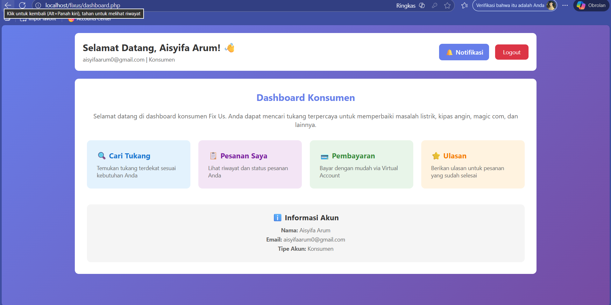
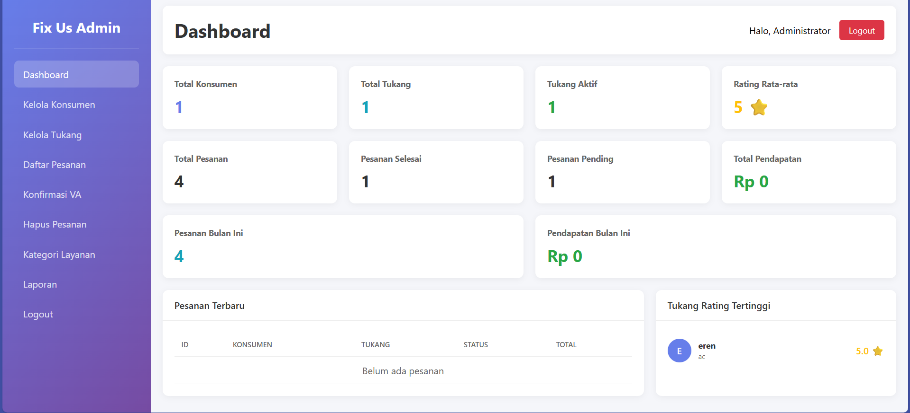
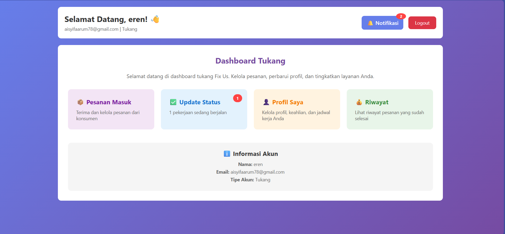

# 🔧 Fix Us - Solusi Perbaikan untuk Anak Kos


---

## 📋 Identitas Project

Nama Project:Fix Us - Solusi Perbaikan untuk Anak Kos

Nama Kelompok:KELOMPOK 7

Anggota Kelompok:
1. [Aisyifa Arum] - [701230067]
2. [Diah Novinda] - [701230061]
3. [Icha Maretha] - [701230066]
4. [Nabila Putri Ramadani - [71230070]]
<!-- Tambahkan anggota sesuai kebutuhan -->

Dosen Pengampu:Dila Nurlaila, M.Kom
Mata Kuliah: Rekayasa Perangkat Lunak

---

📖 Deskripsi Singkat

Fix Us adalah aplikasi berbasis web yang membantu anak kos menemukan tukang untuk memperbaiki masalah sederhana seperti listrik, kipas angin, AC,dan lain-lain. Terdapat dua pengguna utama: konsumen (anak kos) dan tukang. Konsumen dapat registrasi, memesan jasa, membayar via QRIS, dan memberi ulasan. Tukang bisa mengelola profil, menerima pesanan, dan memperbarui status pekerjaan. Fix Us mempermudah anak kos mencari bantuan perbaikan dengan cepat dan praktis.  


---

🎯 Tujuan Sistem

Permasalahan yang Diselesaikan:

1. Kesulitan Mencari Tukang Terpercaya
   - Konsumen sering kesulitan menemukan tukang yang qualified dan terpercaya
   - Tidak ada sistem rating/review untuk menilai kualitas tukang

2. Proses Booking yang Tidak Efisien
   - Booking masih dilakukan secara manual via telepon/chat
   - Tidak ada sistem tracking status pekerjaan

3. Transparansi Harga
   - Harga ditentukan setelah pekerjaan selesai oleh tukang
   - Konsumen mendapat notifikasi untuk pembayaran setelah harga ditentukan

4. Manajemen Pembayaran Manual
   - Pembayaran melalui transfer bank ke rekening admin
   - Admin memverifikasi pembayaran secara manual

---

🛠️ Teknologi yang Digunakan

Backend:
- PHP 8.2 - Server-side programming
- MySQL 5.7+ - Database management
- Apache - Web server

Frontend:
- HTML5 - Structure
- CSS3 - Styling (Custom CSS tanpa framework)
- JavaScript (Vanilla JS) - Client-side interactivity

Security:
- Prepared Statements - SQL Injection prevention
- Password Hashing (bcrypt) - Secure password storage
- CSRF Tokens - Cross-Site Request Forgery protection
- XSS Protection - htmlspecialchars() implementation
- Session Security - HttpOnly cookies, session regeneration

---

✨ Fitur Utama

👤 Untuk Konsumen:
- 🔍 Cari tukang berdasarkan keahlian (Listrik, AC, Kipas Angin, dll)
- 📋 Booking dengan jadwal dan alamat
- 💳 Pembayaran manual transfer bank
- ⏳ Menunggu harga dari tukang (harga ditentukan setelah selesai)
- ⭐ Review & rating tukang
- 🔔 Notifikasi real-time
- 📱 Responsive design

🔧 Untuk Tukang:
- 📬 Lihat pesanan masuk
- ✅ Terima/tolak pesanan
- 🔄 Update status pekerjaan (Diterima → Proses → Selesai)
- 💰 Tentukan harga setelah pekerjaan selesai
- 👤 Profil & portfolio
- ⭐ Lihat rating dari konsumen

👨‍💼 Untuk Admin:
- 📊 Dashboard statistik
- 👥 Kelola konsumen & tukang
- 💰 Konfirmasi pembayaran
- 📈 Laporan revenue
- 🖥️ System monitor
- 🗑️ Hapus data pesanan

---

🚀 Cara Menjalankan Aplikasi

Prerequisites:
- PHP 8.0 atau lebih tinggi
- MySQL 5.7 atau lebih tinggi
- Apache Server (XAMPP/WAMP/LAMP)
- Git (optional)

---

1. Instalasi

A. Clone Repository
```bash
git clone https://github.com/[username]/fixus.git
cd fixus
```

Atau download ZIP dan extract ke `c:\xampp\htdocs\`

B. Import Database
1. Buka phpMyAdmin: `http://localhost/phpmyadmin`
2. Create database baru: `fixus_db`
3. Import file SQL (jika disediakan terpisah)

Struktur database:
- `konsumen` - Data konsumen
- `tukang` - Data tukang
- `admin` - Data admin
- `pesanan` - Data pesanan
- `virtual_account` - Data pembayaran
- `reviews` - Review & rating
- `kategori_layanan` - Kategori layanan
- `rekening_admin` - Rekening admin untuk pembayaran
- `notification_log` - Log notifikasi
- `remember_tokens` - Remember me tokens

---

2. Konfigurasi

A. Copy File Config
```bash
copy config.example.php config.php
copy admin\config.example.php admin\config.php
```

B. Edit Database Configuration

Edit `config.php`:
```php
define('DB_HOST', 'localhost');
define('DB_USER', 'root');           // sesuaikan
define('DB_PASS', '');               // sesuaikan
define('DB_NAME', 'fixus_db');
```

Edit `admin/config.php`:
```php
$host = 'localhost';
$username = 'root';                  // sesuaikan
$password = '';                      // sesuaikan
$database = 'fixus_db';
```

C. Setup Rekening Admin
Jalankan query SQL ini:
```sql
INSERT INTO rekening_admin (bank, nomor_rekening, nama_pemilik, is_active)
VALUES ('BRI', '791501005094509', 'Aisyifa Arum', 'yes');
```

D. Buat Admin Account
```sql
INSERT INTO admin (username, email, password, nama_lengkap)
VALUES (
    'admin',
    'admin@fixus.com',
    '$2y$10$92IXUNpkjO0rOQ5byMi.Ye4oKoEa3Ro9llC/.og/at2.uheWG/igi',
    'Administrator'
);
```

---

3. Menjalankan Aplikasi

1. Start XAMPP (Apache + MySQL)
2. Buka browser dan akses:
   ```
   Konsumen: http://localhost/fixus/
   Admin:    http://localhost/fixus/admin/login.php
   ```

---

🔐 Akun Demo

Admin:
- Username: `admin`
- Password: `admin123`
- URL: `http://localhost/fixus/admin/login.php`

Konsumen & Tukang:
Silakan register di halaman `/register.php`

---

🔗 Link Deployment

<!-- Isi setelah deploy -->
- Demo Live: [URL Deployment Anda]
- Video Demo: [Link Video YouTube/Google Drive]

---

## 📸 Screenshot Aplikasi

Halaman Utama Konsumen:


Dashboard Admin:


Pesanan Tukang:


<!-- Tambahkan screenshot ke folder docs/screenshots/ -->

---

📝 Catatan Tambahan

Keterbatasan Sistem:
- Pembayaran masih manual via transfer bank (belum terintegrasi payment gateway)
- Notifikasi hanya via web (belum ada email/SMS)
- Belum ada fitur chat real-time antara konsumen dan tukang
- Upload foto bukti transfer masih dalam development

Fitur yang Belum Selesai:
- ❌ Payment gateway integration (Midtrans/Xendit)
- ❌ Email notifications
- ❌ SMS notifications
- ❌ Real-time chat konsumen-tukang
- ❌ Upload foto bukti transfer

Petunjuk Penggunaan Khusus:

Alur Booking:
1. Konsumen booking tukang → Status: "Menunggu Konfirmasi"
2. Tukang terima pesanan → Status: "Diterima"
3. Tukang mulai kerja → Status: "Proses"
4. Tukang selesai + input harga → Buat payment
5. Konsumen bayar → Admin verifikasi → Lunas
6. Konsumen bisa review & rating

Alur Pembayaran:
- Harga **ditentukan oleh tukang** setelah pekerjaan selesai
- Konsumen mendapat notifikasi untuk bayar setelah harga ditentukan
- Admin verifikasi pembayaran secara manual

---

📚 Keterangan Tugas

Project ini dibuat untuk memenuhi tugas **Final Project** mata kuliah **Rekayasa Perangkat Lunak**.

Dosen Pengampu: Dila Nurlaila, M.Kom
Semester: 5 Tahun Akademik 2025/2026
Program Studi: Sistem Informasi
Universitas: UIN Sulthan Thaha Saifuddin Jambi

---

📄 License

MIT License - Free to use for educational purposes

---

👨‍💻 Developer

Developed by: Kelompok 7

---

📞 Support

Untuk pertanyaan atau bantuan:
- 📧 Email: [aisyifaarum78@gmail.com]

---

⭐ Jika project ini membantu, berikan star di GitHub!
